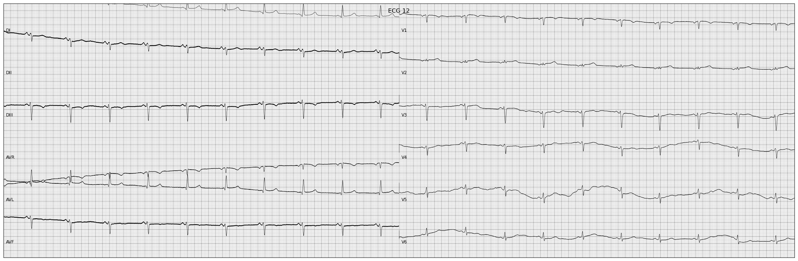
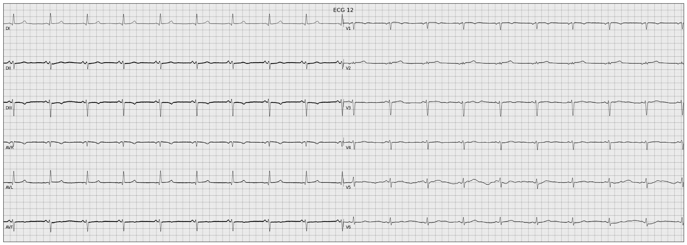

# ECG Preprocessing

Scripts for preprocessing the 12-ECGs for deep learning.

This preprocessing is used for generating the data for the models in:
- https://github.com/antonior92/ecg-age-prediction
- https://github.com/antonior92/automatic-ecg-diagnosis

Some of the datasets from our group are made available after this preprocessing stage and stored as HDF5 file:
- CODE-15%: https://doi.org/10.5281/zenodo.4916206
- SamiTop: https://doi.org/10.5281/zenodo.4905618
- CODE-Test: https://doi.org/10.5281/zenodo.3765780

# Example 

Some example WFDB files before preprocessing are available in the [link](https://www.dropbox.com/sh/zmbd3y68vu7xzyv/AAAsnS766BfWhSxwvcOOVGAXa?dl=0)
and can be downloaded through the commands
```sh
wget https://www.dropbox.com/s/rbxe71a2l9ukoeg/example_exams.zip?dl=0 -O example_exams.zip
unzip example_exams.zip
> cat example_exams/RECORDS.txt 
TNMG437332_N1
TNMG247003_N1
TNMG247001_N1
TNMG247005_N1
TNMG2905463_N1
TNMG2834_N1
TNMG286512_N1
TNMG2678117_N1
```
There are 8 exams in the folder and they have the name `TNMG{$ID}_N1` where $ID is the exam id. 
To each there is a corresponding header file `.hea` and a `.dat` file containing the tracing.
The first four exams belong to the [SamiTrop dataset](https://doi.org/10.5281/zenodo.4905618) and the last four from
the [CODE-15% dataset](https://doi.org/10.5281/zenodo.4916206).  You can check them there by searching for the 
corresponding exam ids.

# Example: plot the exam before and after the removing baseline

Before removing baseline:
```sh
PATH_TO_EXAM=example_exams/TNMG247001_N1
python plot_from_ecg.py $PATH_TO_EXAM --use_all_leads
```


After  removing baseline:
```sh
python plot_from_ecg.py $PATH_TO_EXAM --remove_baseline --use_all_leads
```



# Example: plot periodogram

We also provide functionalities to plot the periodogram from the ecg:
```sh
PATH_TO_EXAM=example_exams/TNMG2834_N1
python plot_periodogram.py $PATH_TO_EXAM
```


# Generate HDF5 from WFDB

The following command read ECG paths from RECORDS.txt sequentially and store them in an hdf5 file:
```sh
python generate_h5.py example_exams/RECORDS.txt example_exams.h5
```

# Available datasets in HDF5
The datasets:
- CODE-15%: https://doi.org/10.5281/zenodo.4916206
- SamiTop: https://doi.org/10.5281/zenodo.4905618

were obtained by something equivalent to the following command. 
```sh
python generate_h5.py --scale 2 --use_all_leads --new_freq 400 --new_len 4096 example_exams/RECORDS.txt example_exams.h5
```
So, they were scaled by 2, the leads were added so it compleate the 12 leads, they are resampled 
to 400Hz and have their length changed to 4096.  The baseline was not removed.

